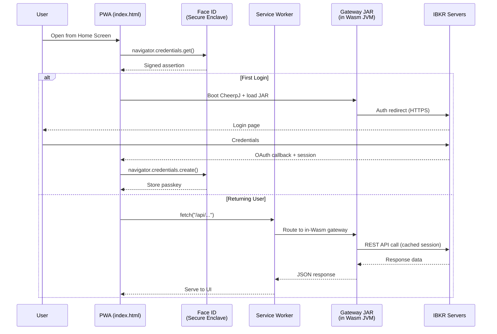
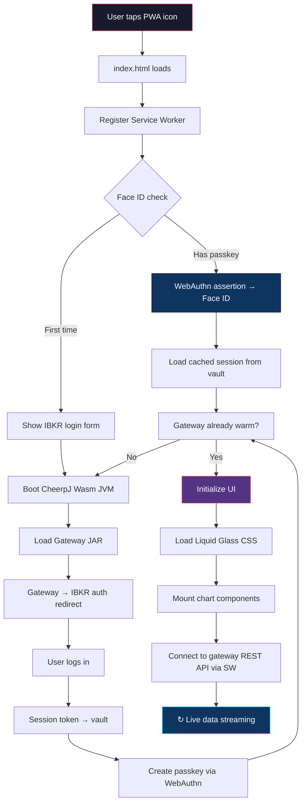

# CSA.IBKR — iOS 26 PWA Architecture Deep Research

> **Target Platform**: iOS 26.4 Developer Beta · Safari 26 · iPhone 15 Pro+
> **Architecture Goal**: Zero-server, client-only PWA running IBKR's Java Client Portal Gateway in-browser via WebAssembly, with Liquid Glass UI and SOTA charting

---

## 1. iOS 26 PWA Capabilities (Safari 26 / WebKit)

### 1.1 Home Screen & Standalone Mode
- **Auto Web App Mode**: iOS 26 defaults to opening Home Screen websites as standalone web apps in their own container, separate from Safari — even without an explicit manifest `display` field
- **Manifest Toggle**: iOS presents users a toggle to save as "web app" vs. "bookmark" — always include a full `manifest.json`
- **Scoped Link Opening**: Links clicked *outside* a browser that fall within the web app's `scope` open directly in the PWA

### 1.2 Push Notifications & Badges
- Push Notifications via `PushManager` (since iOS 16.4) — **only for Home Screen installed PWAs**
- Badge API for icon badge counts (since iOS 16.4)
- Declarative Web Push (Safari 18.4+) for simplified notification setup

### 1.3 Service Worker
- Full `fetch` event interception — can proxy all PWA network requests
- Cache Storage API for offline-first patterns
- `localhost` is treated as a secure context (critical for CheerpJ gateway proxy)
- Background Sync available (iOS 15.4+) but limited compared to Android

### 1.4 Screen Wake Lock
- `navigator.wakeLock.request('screen')` supported since Safari 18.4
- Essential for keeping live trading charts active

### 1.5 WebGPU (Safari 26)
- Ships on iPhone 15 Pro+ — maps directly to Apple Metal
- Higher frame rates, lower CPU/battery for demanding visualizations
- **Key for SOTA chart rendering** — enables GPU-accelerated candlestick/line charts at millions of data points

### 1.6 New Web APIs in Safari 26
| API | Purpose for CSA.IBKR |
|-----|---------------------|
| **Digital Credentials API** | W3C standard for requesting identity docs from Apple Wallet — potential future auth |
| **WebAuthn / Passkeys** | Face ID / Touch ID login — **primary auth mechanism** |
| **File System WritableStream** | Direct file writing for trade logs, chart data export |
| **URLPattern** | Clean routing for Service Worker request matching |
| **Trusted Types** | XSS prevention for dynamic content |
| **Scoped Custom Element Registry** | Isolated web components per module |
| **WebAssembly in-place interpreter** | Performance boost for CheerpJ/Wasm JVM workloads |

### 1.7 CSS / Rendering
- **Anchor Positioning** — float elements relative to others (dock, overlays)
- **Scroll-Driven Animations** — smooth chart scroll effects
- **`progress()` function** — animated loading states
- **`text-wrap: pretty`** — better text layout in fundamentals panels
- **HDR Images** — XDR display support for P3 color gamut charts

---

## 2. Storage Architecture

### 2.1 Available Storage APIs

| API | Quota | Persistence | Best For |
|-----|-------|-------------|----------|
| **IndexedDB** | Up to 60% disk (browser app) | Persistent if Home Screen installed | Trade history, settings, session tokens |
| **OPFS** (Origin Private File System) | Within same quota | Same eviction policies | High-perf file I/O, Wasm file ops for CheerpJ |
| **Cache API** | Within same quota | Same eviction policies | Offline assets, Service Worker cache |
| **localStorage** | ~5MB | 7-day script-writable cap (if not Home Screen) | Small config values only |

### 2.2 Eviction & Persistence Strategy

> [!IMPORTANT]
> Safari's 7-day eviction policy for script-writable storage **does NOT apply** to Home Screen installed PWAs that are regularly used. The app MUST be installed to Home Screen for reliable persistence.

- Request persistent storage: `navigator.storage.persist()` — WebKit grants heuristically, favoring Home Screen apps
- Maximum origin quota: **60% of total disk** for the primary browser; 15% for non-browser apps
- Storage is **not shared** between Safari tabs and standalone PWA — each gets its own origin quota

### 2.3 Vault Architecture (SFTi.IOS/storage)
```
SFTi.IOS/storage/
├── vault.js          ← Encrypted credential store using IndexedDB + Web Crypto API
├── session.js        ← IBKR session token management
├── trade-log.js      ← Trade history persistence (OPFS for bulk, IndexedDB for queries)
└── cache-policy.js   ← Service Worker cache strategy configs
```

---

## 3. Authentication — Face ID & IBKR Gateway

### 3.1 WebAuthn / Passkeys (Face ID Integration)

**Mechanism**: WebAuthn (FIDO2) is fully supported in Safari for Home Screen PWAs.

```
Flow:
1. User opens PWA first time → standard IBKR credential entry
2. PWA calls navigator.credentials.create() → iPhone prompts Face ID
3. Device generates keypair → private key stays in Secure Enclave
4. Public key stored with PWA's backend-equivalent (or locally)
5. Future logins: navigator.credentials.get() → Face ID → auto-authenticate
6. Gateway session token stored in encrypted vault (IndexedDB + Web Crypto)
```

> [!NOTE]
> Face ID biometric data **never** leaves the hardware Secure Enclave. The browser receives only a cryptographic signature (yes/no). This is the gold standard for PWA auth in 2026.

### 3.2 IBKR Client Portal Gateway Auth

**Current State** (IBKR individual accounts):
- Requires running the **Java Client Portal Gateway** locally
- Auth via browser redirect to `https://localhost:5000`
- Session-based (not token/OAuth for individual accounts)
- OAuth 1.0a/2.0 exists but is **institutional only**

**In-Browser Architecture** (via CheerpJ/cheerpJ.local):
```
PWA boots → CheerpJ/custom Wasm JVM starts → loads gateway JAR
→ Gateway binds to virtual "localhost" inside Wasm
→ Service Worker intercepts fetch("https://localhost:5000/...")
→ Routes to in-Wasm gateway HTTP handler
→ Gateway makes outbound HTTPS to IBKR servers
→ CheerpJ bridges outbound calls via browser fetch()
→ Auth: redirect to IBKR login page → OAuth callback → back to PWA
→ Session token → stored in vault → Face ID protects future sessions
```

### 3.3 Auth Flow Diagram


---

## 4. CheerpJ vs. Custom Wasm JVM (`cheerpJ.local`)

### 4.1 CheerpJ Current State (2025-2026)

| Version | Java Support | Key Features |
|---------|-------------|--------------|
| **CheerpJ 4.0** (Apr 2025) | Java 11 stable | JNI via Wasm, mobile touch/virtual keyboard, improved networking |
| **CheerpJ 4.1** (May 2025) | Java 17 preview | Performance optimizations, better mobile Swing/AWT |
| **CheerpJ 5.0** (Late 2025) | Java 17 stable | Target for production use |

- Runs **unmodified JAR files** — no recompilation needed
- Full OpenJDK runtime in Wasm including networking (HTTP/HTTPS bridged via browser `fetch`)
- **Library Mode**: JavaScript ↔ Java interop for calling Java methods from JS
- File system virtualization, clipboard, audio

### 4.2 Building `cheerpJ.local` — Feasibility Analysis

The instructions specify building a **custom CheerpJ imitation** to avoid third-party dependency.

> [!CAUTION]
> Building a fully compatible custom WebAssembly JVM from scratch is an **enormous undertaking** (CheerpJ represents years of engineering). A pragmatic approach is recommended.

**Realistic Options**:

| Approach | Effort | Compatibility | Recommendation |
|----------|--------|---------------|----------------|
| **A. Wrap CheerpJ as a vendored module** | Low | Full | ✅ Best for MVP — vendor CheerpJ runtime files into `cheerpJ.local/`, abstract behind a clean API |
| **B. Use TeaVM to transpile gateway** | Medium | Partial | ⚠️ Requires gateway source code (we don't have it) |
| **C. Use existing Wasm JVM (e.g., adapt Chicory)** | High | Partial | ⚠️ Chicory runs Wasm *in* JVM, not the reverse |
| **D. Build from scratch** | Extreme (years) | Unknown | ❌ Not viable for this project |

**Recommended Architecture for `cheerpJ.local/`**:
```
cheerpJ.local/
├── README.md
├── engine/
│   ├── loader.js       ← JAR loading + init, abstracts CheerpJ API
│   ├── runtime.js      ← Wasm JVM runtime wrapper
│   ├── network.js      ← Browser fetch bridge for gateway HTTP calls
│   └── filesystem.js   ← Virtual FS for gateway config files (conf.yaml etc.)
├── bridge/
│   ├── gateway-api.js  ← JS API for calling gateway REST endpoints
│   └── session.js      ← Session management + keep-alive
└── vendor/             ← CheerpJ runtime files (self-contained, no CDN)
```

---

## 5. Charting Architecture (SFTi.CRPs)

### 5.1 SOTA Charting Technologies

| Library | Renderer | Data Points | Key Strength |
|---------|----------|-------------|--------------|
| **ChartGPU** | WebGPU native | 35M @ 72fps | Open source, pure GPU compute shaders |
| **SciChart.js** | WebGL + Wasm | Millions | Financial-first, candlestick/OHLC built-in |
| **Lightweight Charts** (TradingView) | Canvas 2D | Moderate | Simple, well-known, but lower performance |

**Recommendation**: Build custom charting engine in `SFTi.CRPs/` using **WebGPU** (with WebGL fallback for older devices), inspired by ChartGPU architecture.

### 5.2 Chart Component Structure
```
SFTi.CRPs/
├── README.md
├── core/
│   ├── gpu-renderer.js    ← WebGPU rendering pipeline (Metal on iOS)
│   ├── webgl-fallback.js  ← WebGL2 fallback for non-iPhone 15 Pro
│   ├── data-pipeline.js   ← Streaming data transforms, downsampling
│   └── viewport.js        ← Pan, zoom, crosshair, time axis
├── charts/
│   ├── candlestick.js     ← OHLCV candlestick chart
│   ├── line.js            ← High-perf line chart
│   ├── area.js            ← Filled area chart
│   ├── volume.js          ← Volume bars
│   └── depth.js           ← Market depth chart
└── themes/
    ├── liquid-glass.js    ← Liquid Glass themed chart styling
    └── dark-pro.js        ← Professional dark theme
```

### 5.3 Chart Indicators (SFTi.CIPs)
```
SFTi.CIPs/
├── README.md
├── core/
│   ├── compute.js         ← GPU-accelerated indicator computation
│   └── overlay-manager.js ← Multi-indicator overlay system
├── trend/
│   ├── sma.js, ema.js     ← Moving averages
│   ├── macd.js            ← MACD with signal line
│   └── bollinger.js       ← Bollinger Bands
├── momentum/
│   ├── rsi.js             ← Relative Strength Index
│   ├── stochastic.js      ← Stochastic Oscillator
│   └── williams-r.js      ← Williams %R
├── volume/
│   ├── vwap.js            ← Volume Weighted Average Price
│   └── obv.js             ← On-Balance Volume
└── custom/
    └── template.js        ← Template for adding new indicators
```

---

## 6. iOS System Integration (SFTi.IOS)

### 6.1 Capabilities Matrix

| Feature | PWA Support | Mechanism | Notes |
|---------|-------------|-----------|-------|
| **Face ID / Touch ID** | ✅ Full | WebAuthn / Passkeys | Secure Enclave, no biometric data leaves device |
| **Push Notifications** | ✅ Full | Push API + Service Worker | Home Screen install required |
| **App Icon Badges** | ✅ Full | Badge API | Requires notification permission |
| **Screen Wake Lock** | ✅ Full | Wake Lock API (Safari 18.4+) | Keeps charts alive |
| **Persistent Storage** | ✅ Full | IndexedDB + OPFS + Cache API | Up to 60% disk for Home Screen PWA |
| **Offline Mode** | ✅ Full | Service Worker + Cache | Cache-first strategy |
| **Clipboard** | ✅ Full | Clipboard API | Copy ticker symbols, trade data |
| **Home Screen Widgets** | ❌ None | Requires native WidgetKit + SwiftUI | **Cannot be done from PWA** |
| **Lock Screen Widgets** | ❌ None | Requires native WidgetKit | **Cannot be done from PWA** |
| **Control Center** | ❌ None | Requires native app | **Cannot be done from PWA** |
| **Live Activities** | ❌ None | Requires native ActivityKit | **Cannot be done from PWA** |
| **Screen Overlays** | ❌ None | iOS does not allow any app overlays | Even native apps can't do this |
| **NFC / Bluetooth** | ❌ None | Not available to WebKit | — |

> [!WARNING]
> **Home Screen widgets, Lock Screen widgets, Control Center widgets, and Live Activities all require a native Swift/SwiftUI app with WidgetKit.** No PWA can access these. If these are must-haves, a companion native app (even a thin Swift wrapper) would be required.

> [!TIP]
> **Viable PWA alternative to widgets**: Push notifications with rich content (images, action buttons) can serve as "live updates" similar to Lock Screen widgets. The PWA badge count can show P&L change direction.

### 6.2 SFTi.IOS Module Structure
```
SFTi.IOS/
├── README.md
├── face/
│   ├── webauthn.js       ← WebAuthn registration & assertion
│   ├── passkey-store.js  ← Passkey management
│   └── README.md
├── metadata/
│   ├── manifest.json     ← PWA manifest (icons, theme, display mode)
│   ├── apple-touch.js    ← Apple-specific meta tags & splash screens
│   └── README.md
├── monthlies/
│   └── README.md         ← Monthly P&L reports (generated client-side)
├── patterns/
│   └── README.md         ← Chart pattern recognition configs
├── server/
│   ├── sw.js             ← Service Worker (gateway proxy + cache)
│   ├── push.js           ← Push notification handler
│   └── README.md
├── storage/
│   ├── vault.js          ← Encrypted credential vault (Web Crypto + IndexedDB)
│   ├── trade-log.js      ← Trade persistence (OPFS)
│   ├── settings.js       ← User preferences store
│   └── README.md
├── thoughts/
│   └── README.md         ← Trading journal / notes (client-side)
└── trades/
    ├── executor.js       ← Order execution module
    ├── scanner.js        ← Momentum scanner (7pm scan)
    └── README.md
```

---

## 7. Liquid Glass Design System

### 7.1 CSS Implementation

Core CSS properties for Liquid Glass:
```css
/* Core Liquid Glass Material */
.liquid-glass {
  background: rgba(255, 255, 255, 0.08);
  backdrop-filter: blur(40px) saturate(180%);
  -webkit-backdrop-filter: blur(40px) saturate(180%);
  border: 1px solid rgba(255, 255, 255, 0.15);
  border-radius: 20px;
  box-shadow:
    0 8px 32px rgba(0, 0, 0, 0.12),
    inset 0 1px 0 rgba(255, 255, 255, 0.2),
    inset 0 -1px 0 rgba(0, 0, 0, 0.05);
}

/* Specular highlight (simulates light refraction) */
.liquid-glass::before {
  content: '';
  position: absolute;
  top: 0; left: 0; right: 0;
  height: 50%;
  background: linear-gradient(
    180deg,
    rgba(255, 255, 255, 0.15) 0%,
    rgba(255, 255, 255, 0) 100%
  );
  border-radius: 20px 20px 0 0;
  pointer-events: none;
}
```

### 7.2 Configs Structure
```
system/configs/
├── README.md
├── main.chart/
│   ├── js/
│   │   ├── alignment.js   ← Chart layout & responsive sizing
│   │   └── dynamics.js    ← Animation & transition configs
│   ├── css/
│   │   └── chart.css      ← Chart-specific Liquid Glass styles
│   └── json/
│       └── config.json    ← Chart defaults (timeframe, indicators, colors)
├── dock/
│   ├── css/dock.css
│   └── json/config.json
├── auth/
│   ├── css/login.css
│   └── json/config.json
├── scanner/
│   ├── js/scanner-ui.js
│   ├── css/scanner.css
│   └── json/config.json
├── positions/
│   ├── css/positions.css
│   └── json/config.json
├── fundamentals/
│   ├── css/fundamentals.css
│   └── json/config.json
└── news/
    ├── css/news.css
    └── json/config.json
```

---

## 8. Complete System Architecture

### 8.1 Directory Tree (Target)
```
CSA.IBKR/
├── index.html                    ← PWA shell: CheerpJ init, component loader
├── manifest.json                 ← PWA manifest
├── sw.js                         ← Root Service Worker (or link to SFTi.IOS/server/sw.js)
├── README.md
└── system/
    ├── README.md
    ├── IBKR.CSA/                 ← IBKR Gateway JAR + configs (existing)
    │   ├── clientportal.gw/
    │   │   ├── dist/             ← Gateway JAR
    │   │   ├── build/lib/runtime/← Runtime JARs
    │   │   └── root/             ← Gateway config (conf.yaml)
    │   └── clientportal.gw.zip
    ├── cheerpJ.local/            ← Custom Wasm JVM wrapper
    │   ├── engine/               ← Loader, runtime, networking, filesystem
    │   ├── bridge/               ← Gateway API, session management
    │   └── vendor/               ← Vendored CheerpJ runtime (self-contained)
    ├── SFTi.CRPs/                ← Chart Rendering Plugins
    │   ├── core/                 ← GPU renderer, data pipeline, viewport
    │   ├── charts/               ← Candlestick, line, area, volume, depth
    │   └── themes/               ← Liquid Glass, dark pro themes
    ├── SFTi.CIPs/                ← Chart Indicator Plugins
    │   ├── core/                 ← GPU compute, overlay manager
    │   ├── trend/                ← SMA, EMA, MACD, Bollinger
    │   ├── momentum/             ← RSI, Stochastic, Williams %R
    │   ├── volume/               ← VWAP, OBV
    │   └── custom/               ← Indicator template
    ├── SFTi.IOS/                 ← iOS System Integration
    │   ├── face/                 ← WebAuthn / Face ID
    │   ├── metadata/             ← PWA manifest, Apple meta tags
    │   ├── server/               ← Service Worker, push notifications
    │   ├── storage/              ← Vault, trade log, settings
    │   ├── trades/               ← Order executor, scanner
    │   ├── monthlies/            ← Monthly reports
    │   ├── patterns/             ← Chart pattern configs
    │   └── thoughts/             ← Trading journal
    └── configs/                  ← Component configs (css/js/json per module)
        ├── main.chart/
        ├── dock/
        ├── auth/
        ├── scanner/
        ├── positions/
        ├── fundamentals/
        └── news/
```

### 8.2 Boot Sequence


---

## 9. Key Technical Risks & Mitigations

| Risk | Impact | Mitigation |
|------|--------|------------|
| CheerpJ can't run the IBKR gateway JAR due to Netty/SSL | **Critical** — entire architecture depends on this | Test early. Netty 4.1.15 uses native epoll/kqueue which won't work in Wasm — CheerpJ should fallback to NIO. SSL: CheerpJ bridges HTTPS via browser fetch |
| iOS 26 storage eviction clears session data | **High** — user must re-auth | Use `navigator.storage.persist()`, ensure Home Screen install, implement session refresh |
| WebGPU not available on older iPhones | **Medium** — charts won't render | WebGL2 fallback renderer, feature detection at boot |
| IBKR gateway session timeout (≈24 hours) | **Medium** — trading interruption | Auto-refresh via tickle endpoint `/v1/api/tickle`, background keep-alive in SW |
| Liquid Glass blur performance on complex charts | **Low** — possible frame drops | Reduce blur radius on chart overlays, use `will-change: transform` |

---

## 10. Summary of iOS 26 System Calls Available to PWA

### Fully Available
- `navigator.credentials.create()` / `.get()` — **Face ID / Passkeys**
- `navigator.serviceWorker.register()` — **Service Worker**
- `PushManager.subscribe()` — **Push Notifications**
- `navigator.storage.persist()` — **Persistent Storage**
- `navigator.wakeLock.request('screen')` — **Screen Wake Lock**
- `navigator.gpu` — **WebGPU** (iPhone 15 Pro+)
- `indexedDB` — **IndexedDB** (primary data store)
- `navigator.storage.getDirectory()` — **OPFS** (high-perf file I/O)
- `crypto.subtle` — **Web Crypto API** (encryption for vault)
- `navigator.clipboard` — **Clipboard API**
- `navigator.share()` — **Web Share API**
- `window.matchMedia('(prefers-color-scheme)')` — **Dark mode detection**
- `VisualViewport` API — **Keyboard resize handling**
- `BarcodeDetector` — **QR code scanning** (if needed)

### Not Available (Require Native App)
- WidgetKit (Home Screen / Lock Screen widgets)
- ActivityKit (Live Activities / Dynamic Island)
- Control Center integration
- NFC / Bluetooth / HealthKit
- Screen overlays / picture-in-picture for non-video
- Background App Refresh (limited background sync only)
- App Clips / App Intents / Siri Shortcuts
